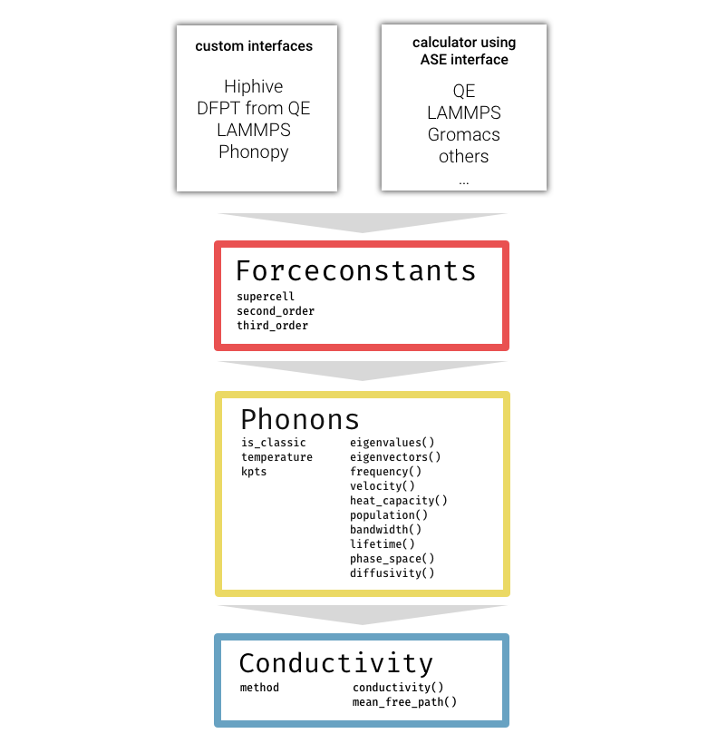

kALDo: Anharmonic Lattice Dynamics
==============================
[//]: # (Badges)

kALDo features real space QHGK calculations and three different solvers of the linearized BTE: direct inversion, self-consistent cycle and RTA.
Below we illustrate the main features of the code

## Code Architecture

## Documentation

The documentation can be found [here](https://nanotheorygroup.github.io/kaldo/)
. Work in progress.

## Copyright

Copyright (c) 2020, Giuseppe Barbalinardo, Zekun Chen, Nicholas W. Lundgren, Davide Donadio

## Acknowledgements

We gratefully acknowledge support by the Investment Software Fellowships (grant No. ACI-1547580-479590) of the NSF Molecular Sciences Software Institute (grant No. ACI-1547580) at Virginia Tech. 

MolSSI builds open source software and data which serves the computational molecular science community. [Explore MolSSI’s software infrastructure projects.](https://molssi.org/software-projects/)
