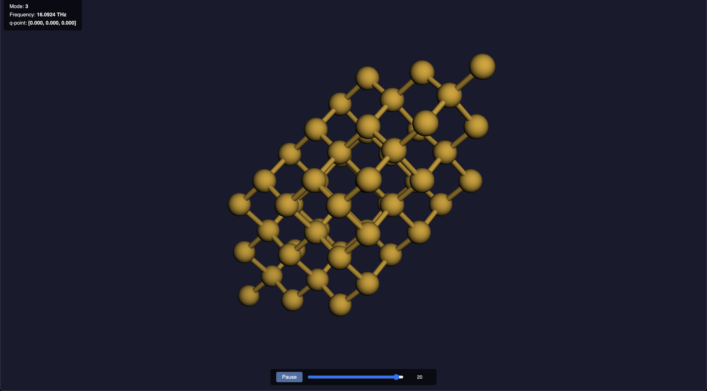

# `phonon_visualization`

This example demonstrates how to visualize phonon eigenmodes as animated trajectories using kALDo. Three output formats are supported: extended-XYZ files (for ASE GUI and OVITO), and standalone HTML files (for browser-based 3D viewing).

## Overview

Phonon eigenmodes describe the collective vibration patterns of atoms in a crystal. Visualizing these modes helps build intuition about:
- Acoustic vs optical branches
- Mode symmetry and degeneracy
- Displacement patterns at different q-points

The displacement of atom *i* in replica *l* at time *t* for mode *s* is:

```
u(t) = A * Re[ e(q) / sqrt(m) * exp(i(2*pi*q.R_l - omega*t)) ]
```

where `e(q)` is the eigenvector, `m` is the atomic mass, `R_l` is the replica position, and `omega = 2*pi*f` is the angular frequency.

## Requirements

Python packages:
- kALDo
- ASE (Atomic Simulation Environment)
- NumPy

No additional packages are needed for the HTML viewer -- it loads [3Dmol.js](https://3dmol.csb.pitt.edu/) from a CDN at runtime.

## Running the Example

```bash
python visualize_modes.py
```

Before running, edit the script to point `folder`, `supercell`, and `format` to your own force constants data. The script will:

1. Load second-order force constants
2. Create a `HarmonicWithQ` object at the Gamma point
3. Print all phonon frequencies
4. Write `.xyz` trajectory files for modes 0, 3, and 6
5. Write `.html` viewer files for the same modes

## Output Files

- `mode_N_traj.xyz` -- Extended-XYZ trajectories (one file per mode)
- `mode_N.html` -- Standalone HTML viewers (one file per mode)

## Viewing Trajectories

### ASE GUI

```bash
ase gui mode_3_traj.xyz
```

Use the frame slider at the bottom to scrub through the animation, or press Play for continuous playback.

### OVITO

```bash
ovito mode_3_traj.xyz
```

OVITO will load the trajectory as a time series. Use the timeline controls at the bottom to animate.

### Browser (3Dmol.js)

```bash
open mode_3.html          # macOS
xdg-open mode_3.html      # Linux
start mode_3.html          # Windows
```

The HTML file is fully self-contained -- it loads [3Dmol.js](https://3dmol.csb.pitt.edu/) from CDN and embeds all atomic coordinate data inline. No local server is needed.



The viewer includes:
- **3D interactive view** -- rotate (left-drag), zoom (scroll), pan (right-drag)
- **Info overlay** (top-left) -- mode index, frequency in THz, q-point
- **Play/Pause button** -- toggle continuous animation
- **Frame slider** -- scrub to any frame manually

#### How 3Dmol.js works

[3Dmol.js](https://3dmol.csb.pitt.edu/) is a WebGL-based molecular viewer that runs entirely in the browser. The generated HTML file uses it as follows:

1. The XYZ trajectory data is embedded as a JavaScript string literal inside a `<script>` tag
2. `$3Dmol.createViewer()` creates a WebGL canvas that fills the browser window
3. `viewer.addModelsAsFrames(xyzData, "xyz")` parses the multi-frame XYZ string into a series of 3D models
4. `viewer.setStyle({}, {stick: {radius: 0.15}, sphere: {scale: 0.3}})` renders atoms as ball-and-stick
5. `viewer.animate({loop: "forward", reps: 0, interval: 50})` plays frames in sequence at 20 fps

The Play/Pause button calls `viewer.animate()` / `viewer.stopAnimate()`, and the slider calls `viewer.setFrame(n)` to jump to a specific frame. A `setInterval` timer keeps the slider in sync during playback.

No data is sent to any server -- everything runs locally in your browser.

## API Reference

The visualization workflow has two layers:

### Model: `HarmonicWithQ.phonon_mode_frames()`

Generates the raw animation frames (list of `ase.Atoms`) from the eigenvectors. This is a pure computation method with no file I/O:

```python
from kaldo.observables.harmonic_with_q import HarmonicWithQ

harmonic = HarmonicWithQ(q_point=q_point, second=fc.second)
frames = harmonic.phonon_mode_frames(
    mode_index=3,       # which phonon branch
    amplitude=0.1,      # peak displacement in Angstroms
    time_step=0.01,     # frame interval in picoseconds
    n_steps=100,        # number of frames
)
```

### View: `plotter.write_phonon_mode_xyz()` and `plotter.write_phonon_mode_html()`

Write the frames to disk in the desired format. These live in `kaldo.controllers.plotter` alongside the other plotting functions:

```python
import kaldo.controllers.plotter as plotter

# Extended-XYZ trajectory
plotter.write_phonon_mode_xyz(harmonic, mode_index=3, filename='mode_3.xyz')

# Standalone HTML viewer
plotter.write_phonon_mode_html(harmonic, mode_index=3, html_filename='mode_3.html')
```

Both functions accept the same `amplitude`, `time_step`, and `n_steps` parameters as `phonon_mode_frames()`.

## Notes

- **Acoustic modes at Gamma**: These have near-zero frequency, which would cause unbounded drift. The code substitutes the lowest optical frequency so acoustic modes animate as oscillating rigid translations.
- **Supercell**: The animation is shown over the full replicated supercell, not just the primitive cell. This makes the displacement pattern easier to see.
- **File size**: HTML files are larger than XYZ because they embed the full trajectory as text. For 100 frames of a 54-atom supercell, expect ~80 KB for HTML and ~65 KB for XYZ.
